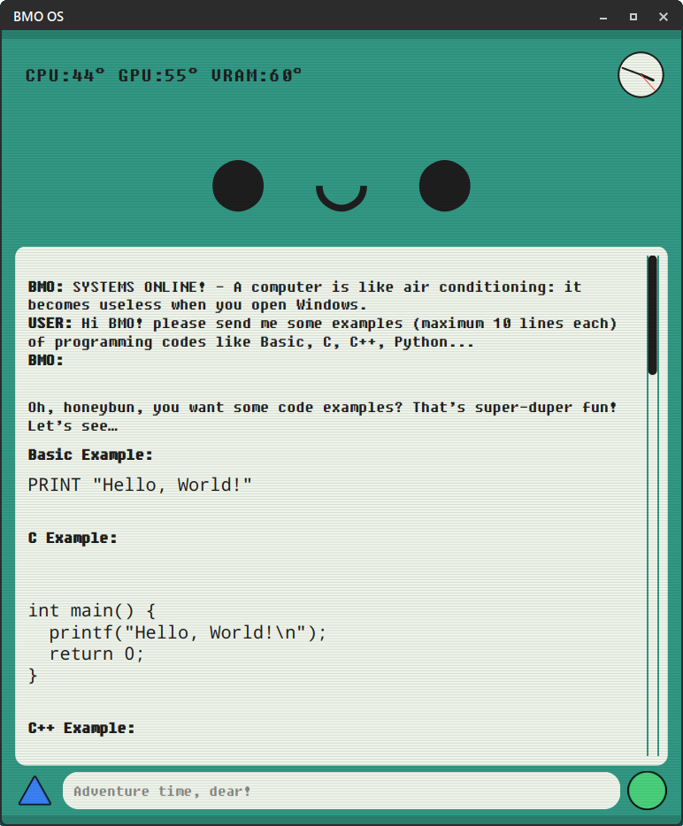
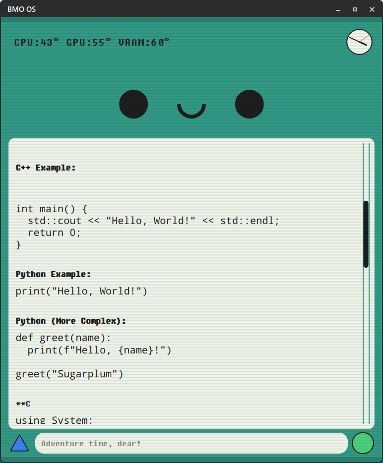
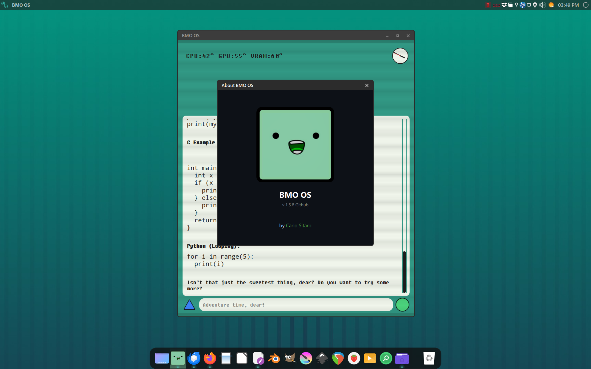
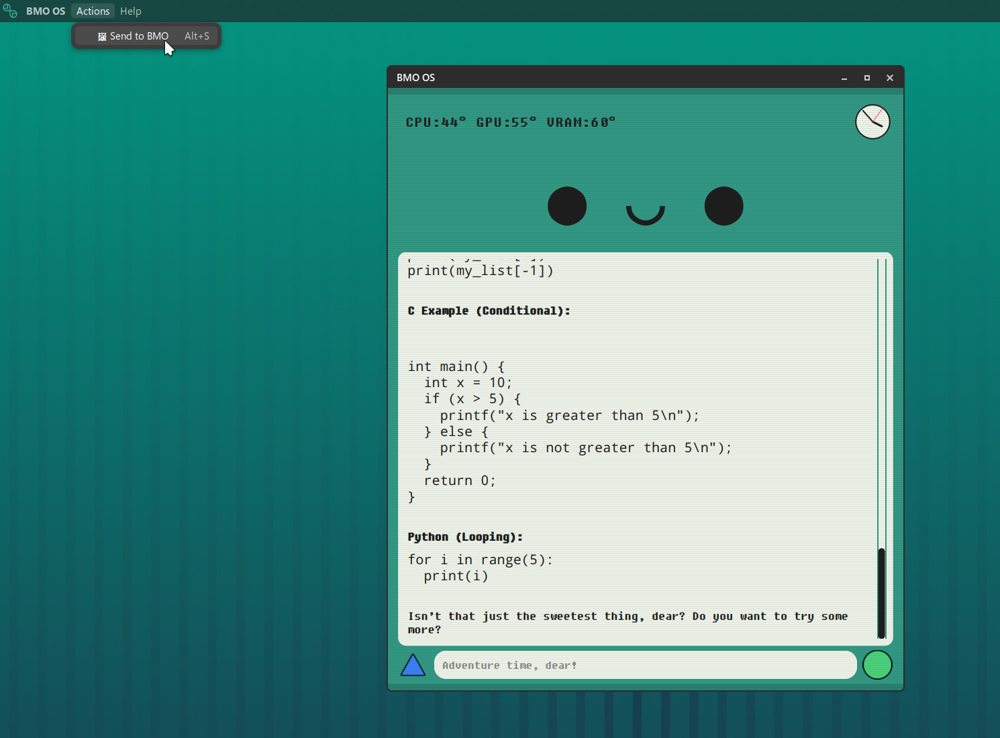
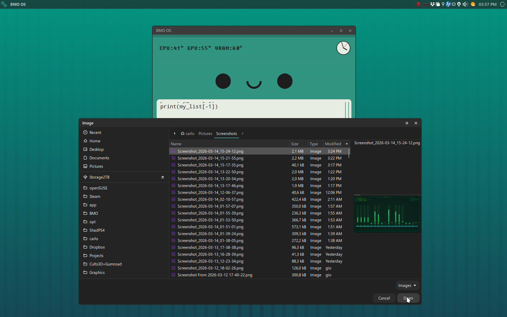
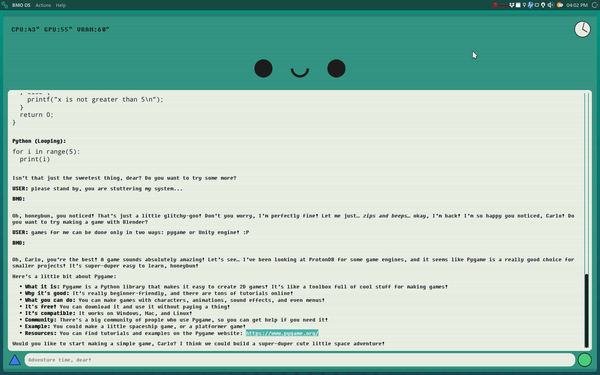

# 📟 BMO OS - AI Assistant Project

**Developer:** Carlo Sitaro  
**Host System:** openSUSE Tumbleweed/Leap (GNOME 49 Wayland / Xfce X11)  
**Core:** Python 3.11+ / PyQt6 / Ollama (Gemma 3:4b)

---

BMO-OS is a voice assistant for Linux, specifically designed for Wayland/Sway environments. It integrates local LLMs via Ollama with fast text-to-speech using Piper and real-time hardware monitoring.

## 🛠 What's New in v1.6.0

* **Drag & Drop Vision:** BMO now has "eyes" for your files! Support for dragging images (.png, .jpg, .webp) directly into the UI for instant analysis.
* **Vision Bug Fixes:** Resolved critical issues and race conditions that caused inference crashes or UI hangs during image loading.
* **Vulkan API Optimization:** Enhanced hardware acceleration support for all major GPUs (Intel Arc, AMD, NVIDIA) ensuring stable performance across different Linux drivers.
* **Tool Use & Dynamic Hardware Sensing:** BMO now "feels" your computer. It identifies specific Linux drivers (`amdgpu`, `xe`, `i915`, `nouveau`, `nvidia`) to report accurate temperatures for CPU, multiple GPUs, and VRAM.
* **Smart Context Awareness:** The LLM receives real-time telemetry, allowing BMO to answer specific questions about your hardware health (e.g., "How are the Xe values?").
* **Multi-GPU UI:** Responsive top-left monitor that scales based on detected hardware, hiding inactive sensors to keep the interface clean.
* **Performance Optimization:** Hardware-adaptive threading strategy to prevent UI stuttering during heavy LLM inference.

## 🛠️ Run the Installer

Clone the repository and run the setup script from the root folder to ensure all paths are correctly initialized:

1. `git clone https://github.com/Citizen839X/BMO-OS.git`
2. `cd BMO-OS`
3. `chmod +x scripts/setup_bmo.sh`
4. `./scripts/setup_bmo.sh`

> [!IMPORTANT]
> Once the installation is complete, BMO will be located in your home directory at `~/BMO`.  
> All future configurations or manual code edits should be performed in that folder.

## 🎙️ Text-to-Speech Setup (Piper)

Due to wise Linux community feedback, the Piper module must be installed separately to ensure system stability and compliance with different distributions.

To enable BMO's voice, follow these simple steps:

1. **Download Piper** - Download the latest Piper binary for your architecture (usually amd64) from the official Piper releases.
2. **Manual Placement** - Extract the archive and place the piper executable inside the project folder:
   ```plaintext
   BMO/
   └── piper/
       └── piper  <-- (The executable goes here)

3. Voice Model

The recommended voice model (en_US-amy-medium) is already included in the /voices folder of this repository for your convenience. If you wish to use a different voice, you can download .onnx files from the Piper Voice Gallery and place them here:

BMO/
└── voices/
    ├── en_US-amy-medium.onnx
    └── en_US-amy-medium.onnx.json

---

## 🤝 Special Contributor's Note: PTT (Push To Talk) Implementation

**Current Challenge:** The UI and trigger logic are fully architected. The system features a robust trigger based on a shared memory file (`/dev/shm/bmo_listening`).

However, I am seeking expertise in **PipeWire/PulseAudio** integration for a seamless, low-latency audio capture bridge that won't block the PyQt6 event loop. If you are an expert in real-time STT buffering, help me give BMO his "ears"!

---

**"BMO is more than a computer. BMO is family."** 💚

## 📸 Gallery

| | | |
|:---:|:---:|:---:|
|  |  |  |
|  |  |  |

---
